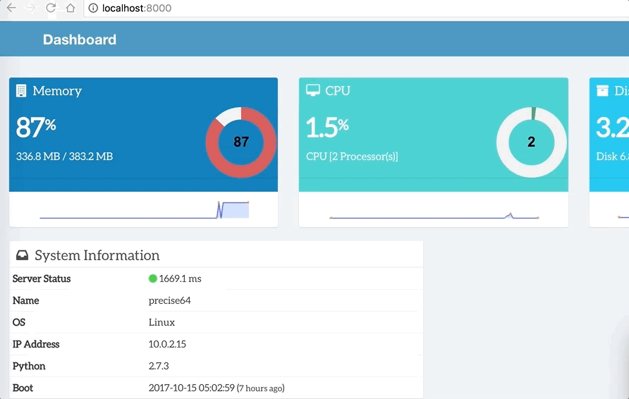
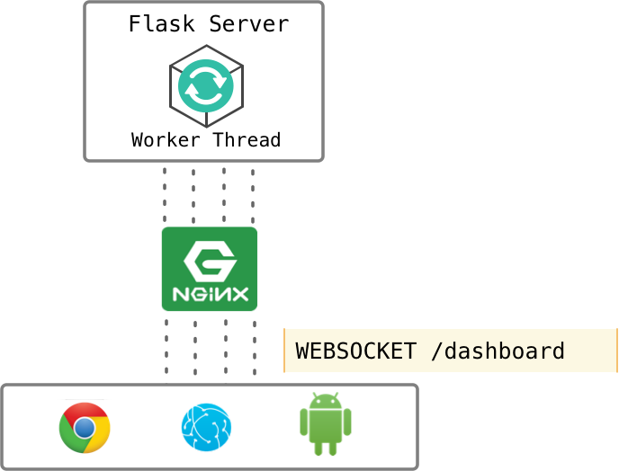

## Introduction



Dashboard has two parts - 

1. Live Data ( CPU, Memory, Disk) - Live updates are served via websockets at regular intervals
2. Static Data (Name, IP, OS etc) - This is fetched once.


## Architecture



System information computation is expensive. It becomes really cumbersome when large number of users fetch on-demand. 

To avoid this problem, websocket is used to send updates from server to each users once there is change in the server resources. 

Only one worker thread does computations which in turn pushes dynamic results to the connected users.


### Components

All components of the whole architecture are as follows

1. Users - HTML5 Browsers
2. Nginx Server - reverse proxy for Flask Server
3. Flask Server - Python webserver with webscoket capability
4. Worker Thread - part of Flask server, it updates users via websockets

### Communication Protocol
HTTP and Websockets

### Logging the events
Access and errors logs are handled at flask server. 

* Log Rotation Policy
* File as well as console logs


Please see logging.conf and app.log for more details.

## Run

### Pre-requisite
Vagrant, Browser (HTML5), Terminal

### How to run
1. Download or Git clone Project from https://github.com/pujansrt/dashboard

	```
	git clone https://github.com/pujansrt/dashboard.git
	```
2. Inside the project (cd dashboard), issue the following command 

	```
	vagrant up
	Bringing machine 'default' up with 'virtualbox' provider...
	==> default: Importing base box 'hashicorp/bionic64'...
	==> default: Matching MAC address for NAT networking...
	==> default: Checking if box 'hashicorp/bionic64' version '1.0.282' is up to date...
	==> default: Setting the name of the VM: dashboard_default_1716456758433_83578
	==> default: Clearing any previously set network interfaces...
	==> default: Preparing network interfaces based on configuration...
    	default: Adapter 1: nat
	==> default: Forwarding ports...
    	default: 80 (guest) => 8000 (host) (adapter 1)
    	default: 22 (guest) => 2222 (host) (adapter 1)
	==> default: Booting VM...
	```
	while it may take several minutes to prepare, you may grab a cup of coffee or tea
	
3. Launch Browser [http://localhost:8000](http://localhost:8000) it should launch dashboard as shown previsouly


## Outcome
Acquired knowledge in the following topics

* Puppet DSL
* Automation of applications
* Vagrant
* Flask SocketIO


<!-- ## Future Improvements -->


## References
1. [https://www.vagrantup.com](https://www.vagrantup.com)
2. [https://www.puppet.com](https://www.puppet.com)
3. [http://flask.pocoo.org](http://flask.pocoo.org)